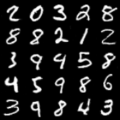

# wgan-gp-pytorch

This repository contains a PyTorch implementation of the Wasserstein GAN with gradient penalty. 

This type of GAN minimizes the objective function given by the Wasserstein-1 distance between the generated data and the real data. For more details, see https://arxiv.org/pdf/1704.00028.pdf.

Some direction was taken from these repositories: https://github.com/arturml/pytorch-wgan-gp, https://github.com/EmilienDupont/wgan-gp. In particular, the Generator and Discriminator architectures were taken from the first repository.

## Generated Images 

Here are some samples from the distribution of the generator:

## Plots

These are the plots for the generator loss, discriminator loss, and gradient penalty. These agree with the plots given in this repository: https://github.com/arturml/pytorch-wgan-gp. 

